# Project One: Author page for Frank Tayell

This author page is a website I have designed to show existing or new fans who the author Frank Tayell is and to give them a greater understanding and knowledge of his work.

The aim for the website is to give fans of Frank Tayell a place to connect with the author. To be able to send direct messages and questions and sign up for newsletters. It is also to increase sales of books as the books page includes all of his books with links to their Amazon sales page to enable easy purchase.

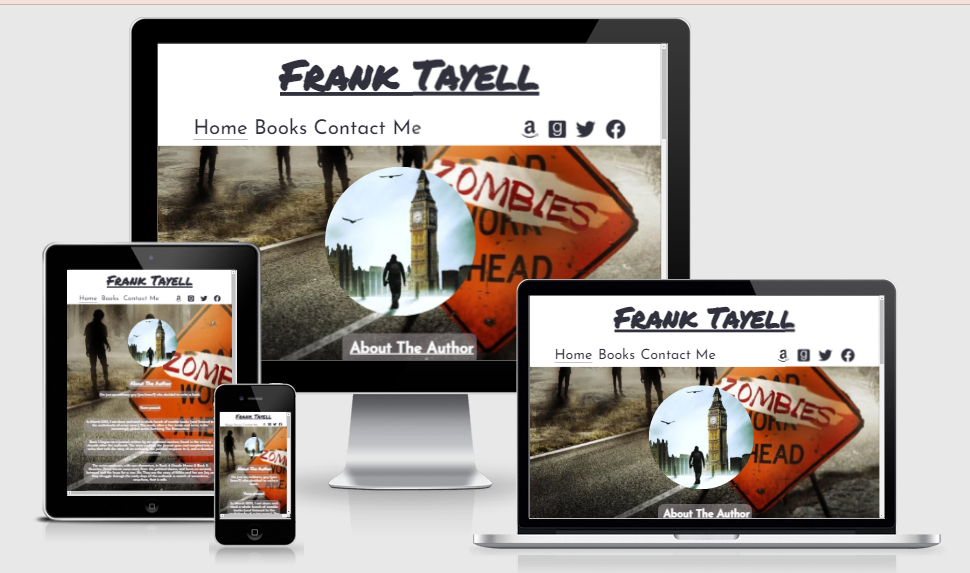

View live site: https://jamesb13579.github.io/first-project/index.html

## Table Of Contents
  * [Features](#features)
  * [Design](#design)
  * [Deployment and Cloning](#deployment-and-cloning)
  * [Testing](#testing)
  * [Technologies used](#technologies-used)
  * [User Stories](#user-stories)
  * [Credits](#credits)
---
## Features

__Header__

In the Header I have included the authors logo, and underneath that placed the nav bar and linked all his social media.

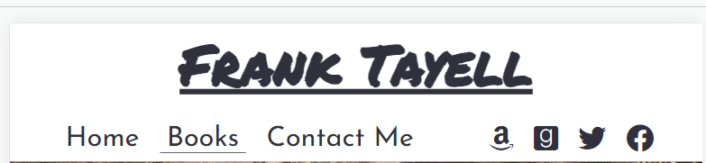

__Navigation__

The navigation menu bar is on the top left of the home page and is an easy way for the user to navigate to their sought after section within the site. To provide users with an introduction to what they can expect to discover on the website, each menu option has been named accordingly to link to its corresponding section. Also included in this section are links to the authors Amazon, Goodreads, Facebook and Twitter profiles.

__Home Page__

The home page has a background image that I have cropped from the front cover of one Frank Tayells books. The image gives the user an idea of the genre of his work.

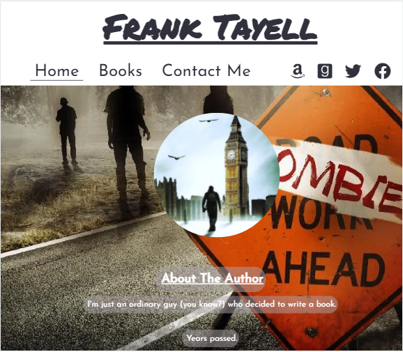

__About Author__

The about author section was supposed to include an image of the author, plus additional information about the author, and the books and series he is working on. Unfortunately, when I was speaking to the author he said he prefers to be judged on his work rather than appearance so I used an image that he uses on his goodreads and amazon instead.

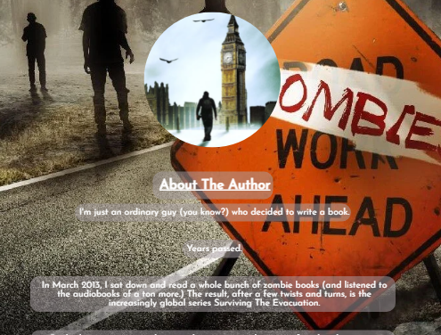

__Books__

The books page shows all of the authors current books split into series, divided with section titles and ordered into release date. The images are all links to the correct Amazon sales page.

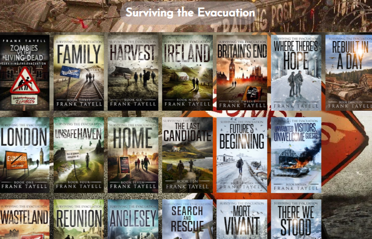

__Subscribe__

The user can subscribe to the authors newsletter as they submit. The user must enter their e-mail address into the input fields for the form to submit. There are prompt messages that appear when this information is not correctly inputted. Currently this goes to code institute file dump.

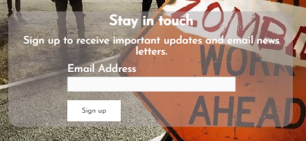

__Message the author__

This section is there to enable direct interaction with the author. Requesting first name, surname, email and message details the user can then submit these details. Again there is a prompt message if information is incorrectly inputted. Currently this goes to code institute file dump.

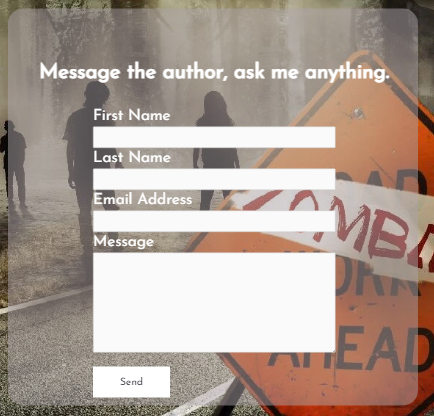

__Hover__

Each clickable element on the website changes color and/or underlines when hovered over with the mouse. Aswell as this I have applied a zoom animation to the book elements when they are hovered over to a scale of 1.05.

__Footer__

In the footer I have included a copyright for the authors images as he asked for that to be included and again, linked all his social media.

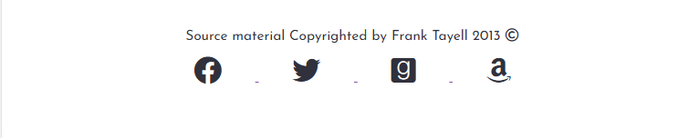

## Design
__Theme__

The author mainly writes dystopian novels so I wanted the imagery to suit that. The font that I used is __Josefin Sans__. I felt this suited the style of website I was trying to create, the font is available from [google fonts](https://https://fonts.google.com/).

__Color Scheme__

The color scheme was chosen using a complimentry color generator, which I play with until I found the options that seemed right to me.

__Photos and Icons__

I chose images suitable to the authors genre and book types plus book cover images.

I used icons for social media websites, I did this to maintain a clean and intuitive user experience.

__Wireframes__

I initailly drew my wireframes out by hand so I could get a more visual idea of what I wanted for my site before I transferred them over to Balsamiq.

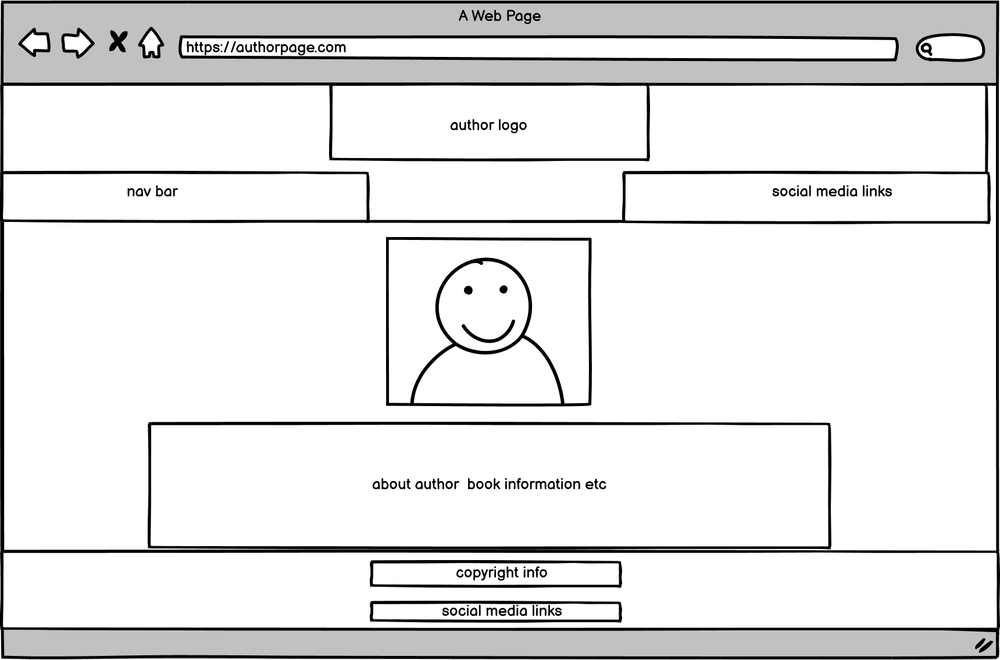

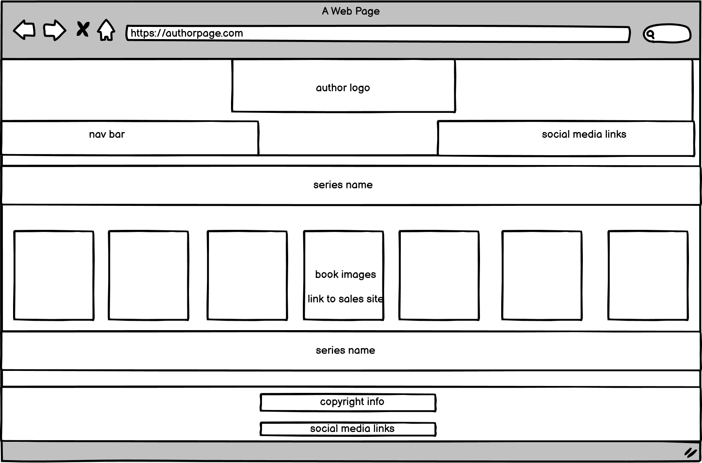

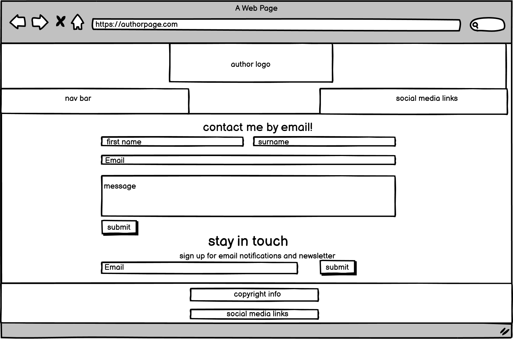

## Deployment and Cloning

__Deployment__

The website was deployed to github pages using the following steps:
- Clicked on my repository for first-project. 
- Clicked settings tab and navigated down to "Pages"
- Selected "Main" in branch drop down box
- Clicked "save" which produced the live link which can be viewed here https://jamesb13579.github.io/first-project/index.html

__Cloning__

In the File menu, click Clone Repository.
- Click the tab that corresponds to the location of the first-project repository.
- Choose the first-project repository from the list of options to clone.
- Click choose and navigate to a local path where you want to clone the repository.
- Click Clone.

## Testing

I used Dev tools in chrome constantly during the development of my code to try and fix the style and catch any issues, I committed and detailed as much as possible of the changes made to my code. 

__Validator Testing__

HTML: No errors reported

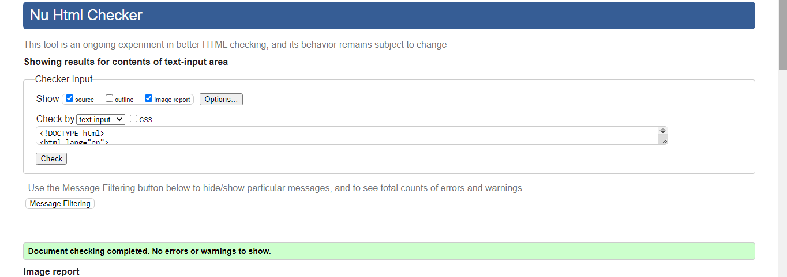

CSS: No errors reported

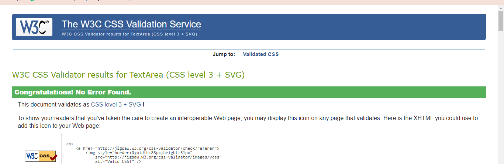

__Lighthouse__
Mobile

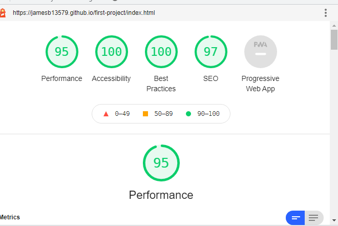

Desktop

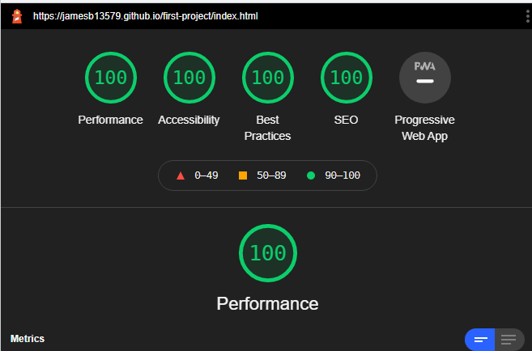

__Bugs & Fixes__
No Bugs at time of deployment.
But I have had issues with a few details of the site when checking mobile responsiveness, which I have fixed using dev tools and editing code incrimentally until I found the issue.

## Technologies used

- HTML5: Used to make the structure and content of the site
- CSS3: Used to style the site content and appearance
- GITPOD: Used to code the site
- GITHUB: Used to store, deploy and host the site
- Balsamiq Wireframes: Used to draft page design and layout

## User Stories

__As a new user__

- I would be like to be able to easily navigate the website.
- I would like to be able to connect with the Author, by having the ability to send  and questions
- I woud like to be able to sign up to be able to be updated on new information from the Author.

__As an existing user__

- I would like to see regular updates to book section, to be able to see whem there is a new book.
- I would like to be able to access this website on the go, so good mobile responsiveness is important.

## Credits

__Tools & Media__

- Fonts used supplied by [Google Fonts](https://https://fonts.google.com/)
- Images used were supplied by the author.
- Icons used made available by [Fontawesome](https://fontawesome.com)
- Color scheme created using the website [Colormind](http://colormind.io/)
- Images used in this document were screen shot from validators and amiresponsive.
- converted images with [Cloud Convert](https://cloudconvert.com/)

__Code and Tutorials__

- Nav bar and social media code inspired by Code Institute Love Running.
- W3schools also helped with me learn extra about css floats and styling.