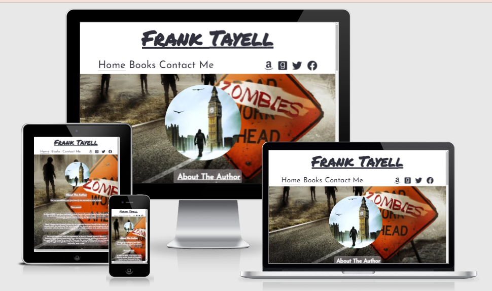
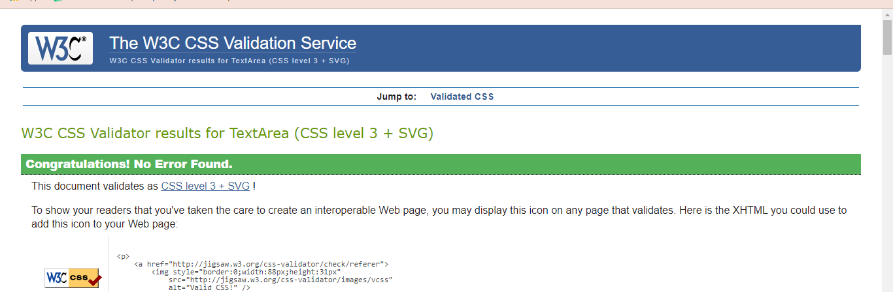
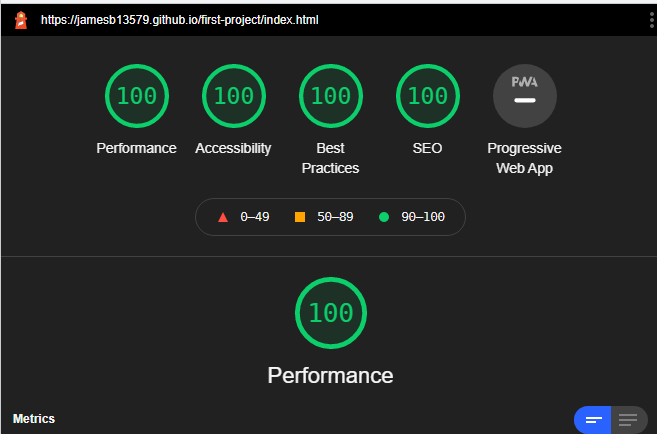

# Project One: Author page for Frank Tayell

This author page is a website i have designed to show existing or new fans who the author Frank Tayell is and to give them a greater understanding and knowledge of his work.

The aim for the website is to give fans of Frank Tayell a place to connect with the author. To be able to send direct messages and questions and sign up for newsletters. It is also to increase sales of books as the books page includes all books with links to there amazon sales page to enable easy purchase.

View live site: https://jamesb13579.github.io/first-project/index.html

## Table Of Contents
  * [Features](#features)
  * [Design](#design)
  * [Deployment](#deployment)
  * [Testing](#testing)
  * [Technologies used](#technologies-used)
  * [Credits](#credits)
---
## Features

__Navigation__
The navigation menu bar is on the top left of the home page is an easy way for the user to navigate to their sought after section within the site. To provide users with an introduction to what they can expect to discover on the website, each menu option has been named accordingly to link to its corresponding section. Also included in this section is links to authors Amazon, Goodreads, Facebook and Twitter.

__Home Page__
The home page has a background image that i have cropped for the front cover of one Frank Tayells books. The image gives the user an idea of the genre of books.

__About Author__
The about author section was surposed to include an image of the author plus additional information about the author, and books and series he is working on. But when i was speaking to the author he said he prefers to be judged on his work rather tham appearance so i used an image that he uses on his goodreads and amazon instead.

__Books__
The books page shows all the authors current books split into series, divided with sextion titles and ordered into release date. The images are all links to the correct amazon sales page.

__Subscribe__
The user can subscribe to the authors newsletter as they submit. The user must enter their e-mail address into the input fields for the form to submit. There are prompt messages that appear when this information is not correctly inputted.Currently this goes to code institute file dump.

__Message the author__
This section is there to enable direct interaction with author. Requesting First name, Surname, Email and Message details the user can then submit these details. Again there is a prompt message if information is incorrectly inputted. Currently this goes to code institute file dump.

__Hover__
Each clickable element on the website changes color and/or underlines when hovered over with the mouse. Aswel as this i have applied a zoom animation to the book elements when they are hovered over to a scale of 1.05.

__Footer__
In the foot i included a copyright for the authors images as he asked for that to be included and again i linked all his social media.

## Design
__Theme__

The author mainly writes dystopian novels so i wanted the imagery to suit that. The font that i used is __Josefin Sans__ i felt this suited the style of website i was trying to create, i got the font from [google fonts](https://https://fonts.google.com/).

__Color Scheme__

The color scheme was chosen using a complimentry color generator, which i play with until i found the options that seemed right to me.

__Photos and Icons__

I chose images suitable to there author genre and book types plus book cover images.

I used icons for social media websites i did this to maintain a clean and intuitive user experience.

__Wireframes__

I initailly drew my wireframes out by hand to i could get a more visual idea of what i wanted for my site before i transferred them over to Balsamiq.

## Deployment

The website was deployed to github pages using the following steps:
- Clicked on my repository for first-project. 
- Clicked settings tab and navigated down to "Pages"
- Selected "Main" in branch drop down box
- Clicked "save" which produced the live link which can be viewed here https://jamesb13579.github.io/first-project/index.html

## Testing

I used Dev tools in chrome constantly during the developement of my code to try and fix the style and catch any issues, I committed and detailed as much as possible the changes made to my code. 

__Validator Testing__

HTML: No errors reported

CSS: No errors reported

__Lighthouse__
Mobile

Desktop

__Bugs & Fixes__
No Bugs at time of deployment.
But i have had issues with a  few details of the site when checking mobile responsiveness, which i have fixed using dev tools and editing code incrimentally until i found the issue.

## Technologies used

- HTML5: Used to make the structure and content of the site
- CSS3: Used to style the site content and appearance
- GITPOD: Used to code the site
- GITHUB: Used to store, deploy and host the site
- Balsamiq Wireframes: Used to draft page design and layout

## Credits

__Tools & Media__

- Fonts used supplied by [Google Fonts](https://https://fonts.google.com/)
- Images used were supplied by the author.
- Icons used made available by [Fontawesome](https://fontawesome.com)
- Color scheme created using the website [Colormind](http://colormind.io/)
- Images used in this document were screen shot from validators and amiresponsive.
- converted images with [Cloud Convert](https://cloudconvert.com/)

__Code and Tutorials__

- Nav bar and social media code inspired by Code Institute Love Running.
- W3schools also helped with me learn extra about css floats and styling.